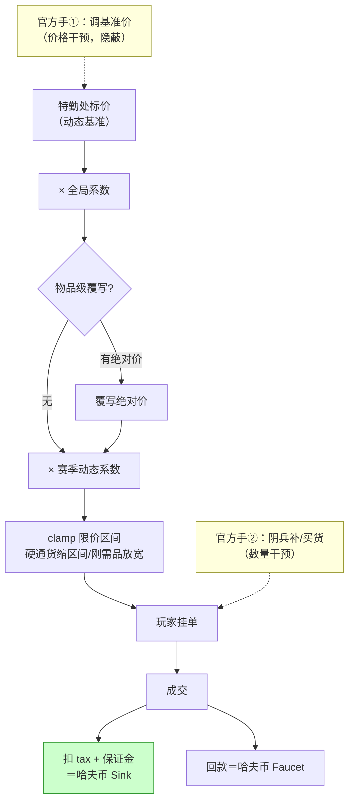

```mermaid
flowchart TD
    TEQ["特勤处标价<br/>（动态基准）"] --> RATIO["× 全局系数"]
    RATIO --> OVR{"物品级覆写?"}
    OVR -->|有绝对价| ABS["覆写绝对价"]
    OVR -->|无| SEASON["× 赛季动态系数"]
    ABS --> SEASON
    SEASON --> CLAMP["clamp 限价区间<br/>硬通货缩区间/刚需品放宽"]
    CLAMP --> LIST["玩家挂单"]
    LIST --> DEAL["成交"]
    DEAL --> TAX["扣 tax + 保证金<br/>＝哈夫币 Sink "]
    DEAL --> BACK["回款＝哈夫币 Faucet"]

    HAND1["官方手①：调基准价<br/>（价格干预，隐蔽）"] -.-> TEQ
    HAND2["官方手②：阴兵补/买货<br/>（数量干预）"] -.-> LIST

    style TAX fill:#cfc,stroke:#393
    style HAND1 fill:#ffd,stroke:#993
    style HAND2 fill:#ffd,stroke:#993
```