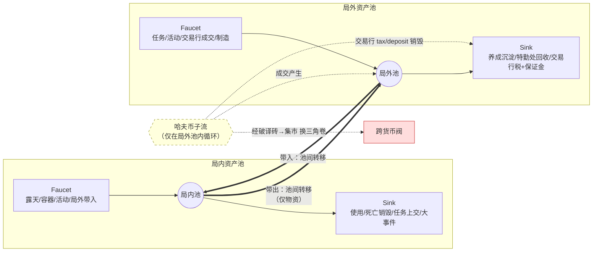

```mermaid
flowchart LR
    subgraph IN["局内资产池"]
        direction TB
        iF["Faucet<br/>露天/容器/活动/局外带入"]
        iS["Sink<br/>使用/死亡销毁/任务上交/大事件"]
        iF --> iPool(("局内池")) --> iS
    end
    subgraph OUT["局外资产池"]
        direction TB
        oF["Faucet<br/>任务/活动/交易行成交/制造"]
        oS["Sink<br/>养成沉淀/特勤处回收/交易行税+保证金"]
        oF --> oPool(("局外池")) --> oS
    end

    iPool ==>|带出：池间转移<br/>（仅物资）| oPool
    oPool ==>|带入：池间转移| iPool

    H{{"哈夫币子流<br/>（仅在局外池内循环）"}} -.->|成交产生| oPool
    H -.->|交易行 tax/deposit 销毁| oS
    H -.->|经破译砖→集市 换三角卷| X["跨货币阀"]

    style H fill:#ffd,stroke:#993,stroke-dasharray: 5 5
    style X fill:#fdd,stroke:#c33
```