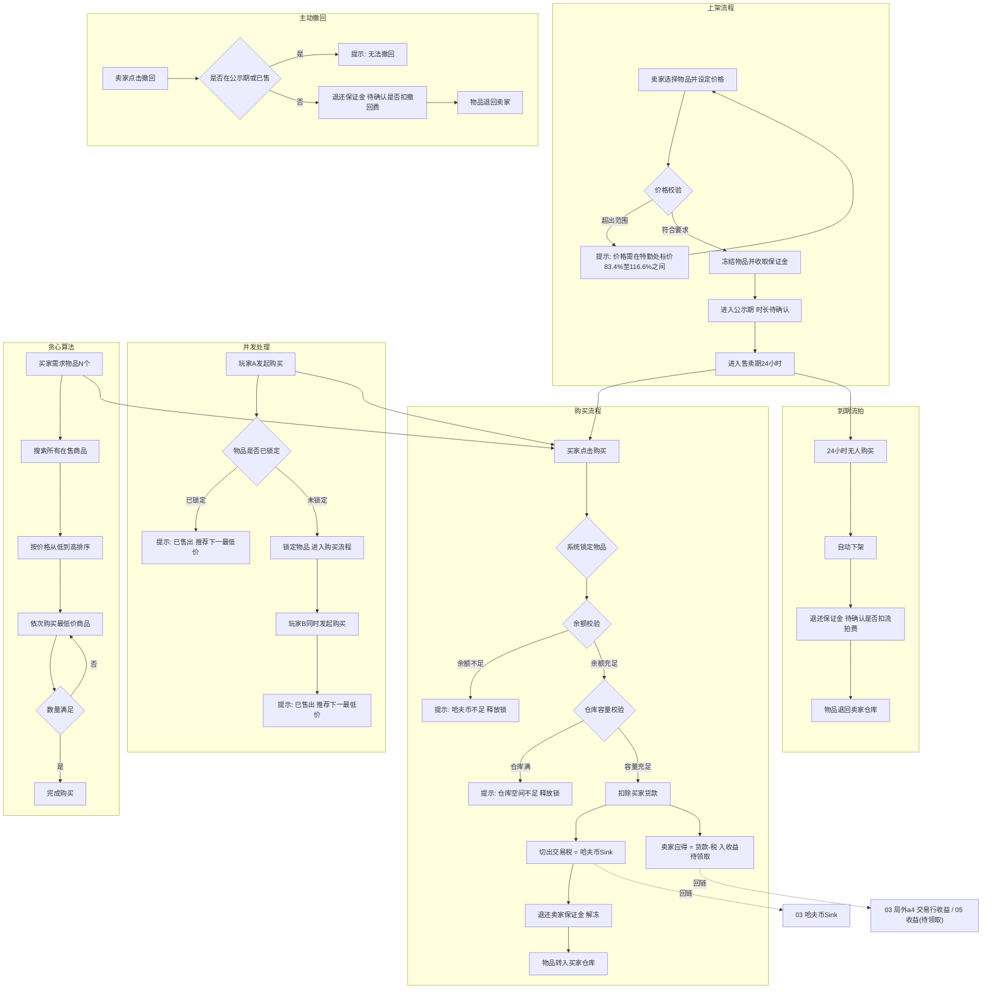

```mermaid
flowchart TD
     %% 订正注：图中 2%税/5%保证金 为结构占位，实测≈10-11%税/3-4%保证金/15%手续费，逐物品+动态，见05机制2。
     %% 待统一注：流拍/撤回"待确认扣费"与05机制5"无惩罚"冲突，见tracker C2。
     subgraph 上架流程
         A1[卖家选择物品并设定价格] --> A2{价格校验}
         A2 -- 超出范围 --> A3[提示: 价格需在特勤处标价83.4%至116.6%之间]
         A3 --> A1
         A2 -- 符合要求 --> A4[冻结物品并收取保证金]
         A4 --> A5[进入公示期 时长待确认]
         A5 --> A6[进入售卖期24小时]
     end
     subgraph 购买流程
         B1[买家点击购买] --> B2{系统锁定物品}
         B2 --> B3{余额校验}
         B3 -- 余额不足 --> B4[提示: 哈夫币不足 释放锁]
         B3 -- 余额充足 --> B5{仓库容量校验}
         B5 -- 仓库满 --> B6[提示: 仓库空间不足 释放锁]
         B5 -- 容量充足 --> B7[扣除买家货款]
         B7 --> B8[切出交易税 = 哈夫币Sink]
         B7 --> B12[卖家应得 = 货款-税 入收益待领取]
         B8 --> B9[退还卖家保证金 解冻]
         B9 --> B10[物品转入买家仓库]
     end
     subgraph 并发处理
         C1[玩家A发起购买] --> C2{物品是否已锁定}
         C2 -- 已锁定 --> C3[提示: 已售出 推荐下一最低价]
         C2 -- 未锁定 --> C4[锁定物品 进入购买流程]
         C4 --> C5[玩家B同时发起购买]
         C5 --> C6[提示: 已售出 推荐下一最低价]
     end
     subgraph 贪心算法
         D1[买家需求物品N个] --> D2[搜索所有在售商品]
         D2 --> D3[按价格从低到高排序]
         D3 --> D4[依次购买最低价商品]
         D4 --> D5{数量满足}
         D5 -- 否 --> D4
         D5 -- 是 --> D6[完成购买]
     end
     subgraph 到期流拍
         E1[24小时无人购买] --> E2[自动下架]
         E2 --> E3[退还保证金 待确认是否扣流拍费]
         E3 --> E4[物品退回卖家仓库]
     end
     subgraph 主动撤回
         F1[卖家点击撤回] --> F2{是否在公示期或已售}
         F2 -- 是 --> F3[提示: 无法撤回]
         F2 -- 否 --> F4[退还保证金 待确认是否扣撤回费]
         F4 --> F5[物品退回卖家]
     end
     %% 改单流程：06原图缺失，功能清单有"修改挂单价格/数量"，涉及保证金/公示期重算，待补，见tracker E。
     A6 --> B1
     A6 --> E1
     C1 --> B1
     D1 --> B1
     B12 -. 回链 .-> Z1["03 局外a4 交易行收益 / 05 收益(待领取)"]
     B8 -. 回链 .-> Z2["03 哈夫币Sink"]
```