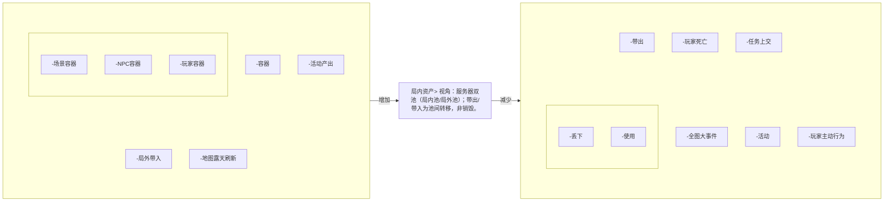

```mermaid
flowchart LR
    subgraph INC["　"]
        direction LR
        subgraph iA["　"]
            direction TB
            i1["-局外带入"]
            i2["-地图露天刷新"]
        end
        subgraph iB["　"]
            direction TB
            i3["-容器"]
            subgraph iBox["　"]
                direction TB
                i3a["-场景容器"]
                i3b["-NPC容器"]
                i3c["-玩家容器"]
            end
            i4["-活动产出"]
        end
    end

    M["局内资产> 视角：服务器双池（局内池/局外池）；带出/带入为池间转移，非销毁。"]

    subgraph DEC["　"]
        direction LR
        subgraph dA["　"]
            direction TB
            d1["-全图大事件"]
            d2["-活动"]
            d3["-玩家主动行为"]
            subgraph dBox["　"]
                direction TB
                d3a["-丢下"]
                d3b["-使用"]
            end
        end
        subgraph dB["　"]
            direction TB
            d4["-带出"]
            d5["-玩家死亡"]
            d6["-任务上交"]
        end
    end

    INC -->|增加| M
    M -->|减少| DEC

    style iA fill:none,stroke:none
    style iB fill:none,stroke:none
    style dA fill:none,stroke:none
    style dB fill:none,stroke:none
```