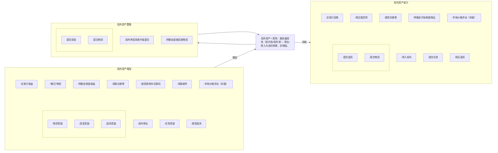

```mermaid
flowchart LR
    subgraph ADD["局外资产增加"]
        direction LR
        subgraph aA["　"]
            direction TB
            a1["-局内带出"]
            a2["-任务奖励"]
            subgraph aBox["　"]
                direction TB
                a2a["-物资奖励"]
                a2b["-现金奖励"]
                a2c["-道具奖励"]
            end
            a3["-使用道具"]
        end
        subgraph aB["　"]
            direction TB
            a4["-交易行收益"]
            a5["-“解压”物资"]
            a6["-特勤处制造收益"]
            a7["-领取兑换卷"]
            a8["-使用游戏外兑换码"]
            a9["-领取邮件"]
            a10["-市场价格浮动（存疑）"]
        end
    end

    subgraph MID["　"]
        direction TB
        M["局外资产> 视角：服务器双池（局内池/局外池）；带出/带入为池间转移，非销毁。"]
        subgraph SWAP["局外资产置换"]
            direction TB
            s1["-局外养成系统升级提交"]
            subgraph sBox["　"]
                direction TB
                s1a["-提交现金"]
                s1b["-提交物资"]
            end
            s2["-特勤处直接回收物资"]
        end
        M --> SWAP
        SWAP --> M
    end

    subgraph SUB["局外资产减少"]
        direction LR
        subgraph bA["　"]
            direction TB
            b1["-带入局内"]
            b2["-提交任务"]
            subgraph bBox["　"]
                direction TB
                b2a["-提交道具"]
                b2b["-提交物资"]
            end
            b3["-购买道具"]
        end
        subgraph bB["　"]
            direction TB
            b4["-交易行挂售"]
            b5["-购买图灵转"]
            b6["-使用兑换卷"]
            b7["-特勤处开始制造物品"]
            b8["-市场价格浮动（存疑）"]
        end
    end

    ADD -->|增加| M
    M -->|消耗| SUB

    style aA fill:none,stroke:none
    style aB fill:none,stroke:none
    style bA fill:none,stroke:none
    style bB fill:none,stroke:none
    style MID fill:none,stroke:none
```