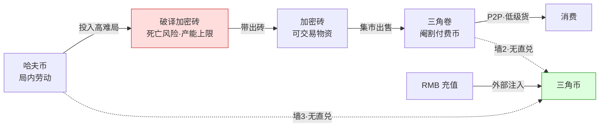

```mermaid
graph LR
    H["哈夫币<br/>局内劳动"] -->|"投入高难局"| RISK["破译加密砖<br/>死亡风险·产能上限"]
    RISK -->|"带出砖"| BRICK["加密砖<br/>可交易物资"]
    BRICK -->|"集市出售"| J["三角卷<br/>阉割付费币"]
    J -->|"P2P·低级货"| USE["消费"]

    H -.->|"墙3·无直兑"| T["三角币"]
    J -.->|"墙2·无直兑"| T
    PAY["RMB 充值"] -->|"外部注入"| T

    style RISK fill:#ffdddd,stroke:#cc3333
    style T fill:#ddffdd,stroke:#339933
```