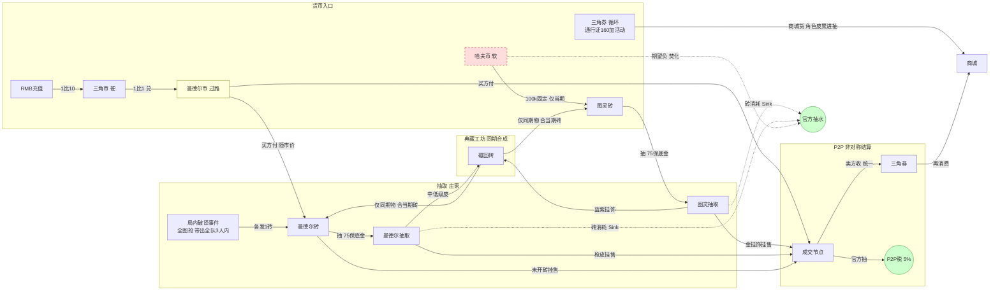

```mermaid
flowchart LR
    subgraph IN["货币入口"]
        direction TB
        RMB["RMB充值"] -->|1比10| TB["三角币 硬"]
        TB -->|1比1 兑| MB["曼德尔币 过路"]
        HF["哈夫币 软"] -->|100k固定 仅当期| TLB["图灵砖"]
        JQ0["三角券 循环<br/>通行证160加活动"]
    end

    subgraph GACHA["抽取 庄家"]
        direction TB
        TLB -->|抽 75保底金| G1["图灵抽取"]
        MDB["曼德尔砖"] -->|抽 75保底金| G2["曼德尔抽取"]
        MB -->|买方付 随市价| MDB
        INGAME["局内破译事件<br/>全图抢 带出全队3人内"] -->|各发1砖| MDB
    end

    subgraph P2P["P2P 非对称结算"]
        direction TB
        P["成交节点"]
        P -->|卖方收 统一| JQ["三角券"]
        P -->|官方抽| TAX2((P2P税 5%))
    end
    MB -->|买方付| P
    G1 -->|金挂饰挂售| P
    G2 -->|枪皮挂售| P
    MDB -->|未开砖挂售| P

    subgraph CRAFT["典藏工坊 同期合成"]
        direction TB
        G1 -->|蓝紫挂饰| CW["碾回砖"]
        G2 -->|中低级皮| CW
        CW -->|仅同期物 合当期砖| TLB
        CW -->|仅同期物 合当期砖| MDB
    end

    JQ0 -->|商城货 角色皮累进抽| MALL["商城"]
    JQ -->|再消费| MALL

    G1 -. 砖消耗 Sink .-> SK1((官方抽水))
    G2 -. 砖消耗 Sink .-> SK1
    HF -. 期望负 焚化 .-> SK1

    style MB fill:#ffd,stroke:#993
    style JQ fill:#eef,stroke:#669
    style HF fill:#fdd,stroke:#c33,stroke-dasharray: 5 5
    style SK1 fill:#cfc,stroke:#393
    style TAX2 fill:#cfc,stroke:#393
```